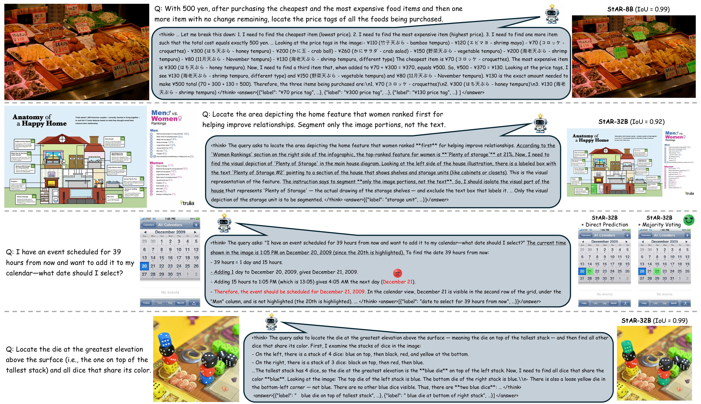
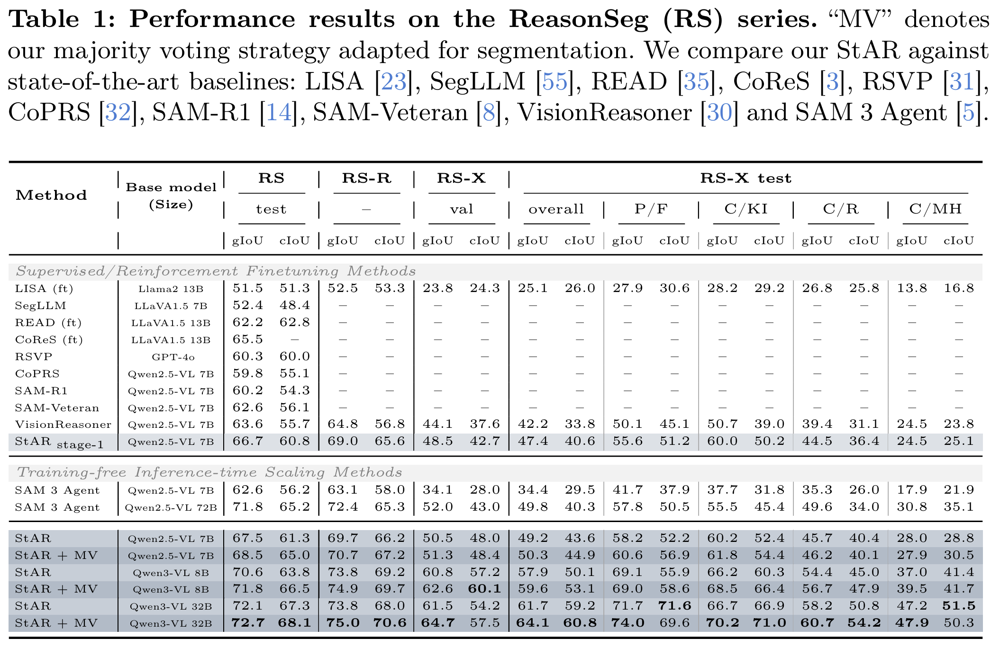
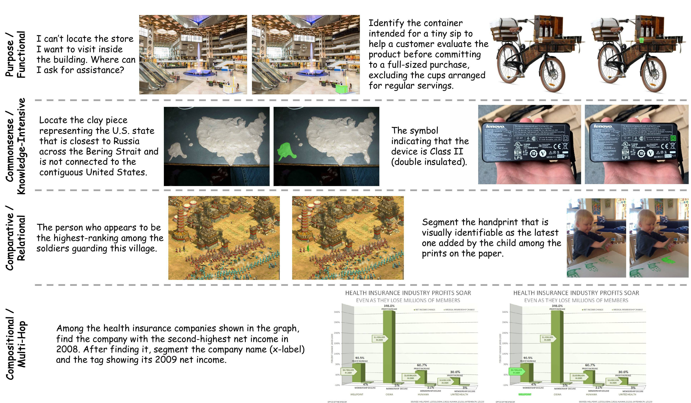

<div align="center">

#  StAR: Segment Anything Reasoner

[[Paper]](https://arxiv.org/abs/2603.14382) [[Models]](https://huggingface.co/sj9909) [[Dataset: ReasonSeg-X]](https://huggingface.co/datasets/sj9909/ReasonSegX_test)

</div>

<div align=center>

</div>

## Abstract

As AI systems are being integrated more rapidly into diverse and complex real-world environments, the ability to perform holistic reasoning over an implicit query and an image to localize a target is becoming increasingly important. However, recent reasoning segmentation methods fail to sufficiently elicit the visual reasoning capabilities of the base model. In this work, we present Segment Anything Reasoner (StAR), a comprehensive framework that refines the design space from multiple perspectives—including parameter-tuning scheme, reward functions, learning strategies and answer format—and achieves substantial improvements over recent baselines. In addition, for the first time, we successfully introduce parallel test-time scaling to the segmentation task, pushing the performance boundary even further. To eXtend the scope and depth of reasoning covered by existing benchmark, we also construct the ReasonSeg-X, which compactly defines reasoning types and includes samples that require deeper reasoning. Leveraging this dataset, we train StAR with a rollout-expanded selective-tuning approach to activate the base model’s latent reasoning capabilities, and establish a rigorous benchmark for systematic, fine-grained evaluation of advanced methods. With only 5k training samples, StAR achieves significant gains over its base counterparts across extensive benchmarks, demonstrating that our method effectively brings dormant reasoning competence to the surface.

## Highlights

**StAR** presents a comprehensive framework designed to fully exploit the reasoning potential of base MLLMs, thereby improving their versatile segmentation capabilities. We make the following contributions:

- **Comprehensive Design Space Exploration:** We conduct a thorough study of critical design dimensions for RL-based reasoning segmentation, including parameter-efficient tuning scheme, reward function design, RL strategy, and answer format. This analysis reveals practical guidelines that substantially improve performance over naive configurations.
- **RL Training with Rollout-Expanded Selective Tuning:** Building on our design space findings, we propose a two-stage RL training strategy. Stage 1 builds broad visual grounding capability on diverse data; Stage 2 effectively surfaces the base model’s latent reasoning capabilities via rollout-expanded selective tuning — achieving strong results with only **5K training samples** total.
- **Parallel Test-Time Scaling:** We introduce test-time scaling to reasoning segmentation for the first time, enabling StAR to push the performance boundary further at inference by sampling multiple reasoning paths and aggregating their predictions.
- **ReasonSeg-X Benchmark:** A new benchmark that compactly categorizes reasoning types and includes samples demanding deeper, multi-step reasoning — addressing the limited scope of existing evaluation standards.

StAR achieves significant gains over base counterparts across extensive benchmarks including ReasonSeg, ReasonSeg-R/X, MMR, and MUSE.

### Main Results

We evaluate on the ReasonSeg (RS) series: **RS test** (original), **RS-R** (our refined version with corrected annotations), and **RS-X** (our proposed benchmark with deeper reasoning). "MV" denotes our majority voting strategy adapted for segmentation.

<div align=center>

</div>


## Models

| Model | Base Model | LoRA Rank | Download |
|:------|:-----------|:---------:|:--------:|
| StAR-7B | [Qwen2.5-VL-7B-Instruct](https://huggingface.co/Qwen/Qwen2.5-VL-7B-Instruct) | 64 | [🤗 HuggingFace](https://huggingface.co/sj9909/StAR-7B) |
| StAR-8B | [Qwen3-VL-8B-Instruct](https://huggingface.co/Qwen/Qwen3-VL-8B-Instruct) | 64 | [🤗 HuggingFace](https://huggingface.co/sj9909/StAR-8B) |
| StAR-32B | [Qwen3-VL-32B-Instruct](https://huggingface.co/Qwen/Qwen3-VL-32B-Instruct) | 64 | [🤗 HuggingFace](https://huggingface.co/sj9909/StAR-32B) |


## Installation

We use two separate environments because Qwen3-VL requires newer versions of `transformers` and `vllm`.

<details>
<summary><b>Environment A: Qwen2.5-VL (StAR-7B)</b></summary>

```bash
conda create -n star_qwen2_5 python=3.12
conda activate star_qwen2_5
pip install torch==2.6.0 torchvision==0.21.0
pip install transformers==4.51.3 vllm==0.8.5.post1
pip install -r requirements_qwen2_5.txt
pip install -e . --no-deps
wget https://github.com/Dao-AILab/flash-attention/releases/download/v2.7.4.post1/flash_attn-2.7.4.post1+cu12torch2.6cxx11abiFALSE-cp312-cp312-linux_x86_64.whl
pip install flash_attn-2.7.4.post1+cu12torch2.6cxx11abiFALSE-cp312-cp312-linux_x86_64.whl
```
</details>

<details>
<summary><b>Environment B: Qwen3-VL (StAR-8B, StAR-32B)</b></summary>

```bash
conda create -n star_qwen3 python=3.12
conda activate star_qwen3
pip install transformers==4.57.3 vllm==0.12.0
pip install -r requirements_qwen3.txt
pip install -e . --no-deps
wget https://github.com/Dao-AILab/flash-attention/releases/download/v2.8.3/flash_attn-2.8.3+cu12torch2.9cxx11abiTRUE-cp312-cp312-linux_x86_64.whl
pip install flash_attn-2.8.3+cu12torch2.9cxx11abiTRUE-cp312-cp312-linux_x86_64.whl --no-deps
# Override to exact tested versions (must be last to avoid being overwritten)
pip install torch==2.9.1 --force-reinstall --no-deps --index-url https://download.pytorch.org/whl/cu128
pip install torchvision==0.24.0 --no-deps --index-url https://download.pytorch.org/whl/cu128
pip install nvidia-cudnn-cu12==9.18.1.3 --force-reinstall --no-deps
```
</details>

### SAM 2.1 Checkpoints

Download [SAM 2.1](https://github.com/facebookresearch/sam2) checkpoints:

```bash
cd sam2/checkpoints && bash download_ckpts.sh && cd ../..
```


## Inference

Download the pretrained LoRA weights and run inference on your own images:

```bash
# Download model
huggingface-cli download sj9909/StAR-7B --local-dir pretrained_models/StAR-7B

# Run inference (Qwen2.5-VL)
python inference_scripts/infer_multi_object.py \
    --reasoning_model_path pretrained_models/StAR-7B/huggingface \
    --use_lora true \
    --image_path "your_image.jpg" \
    --text "your question"
```

For Qwen3-VL models:
```bash
# Download model
huggingface-cli download sj9909/StAR-8B --local-dir pretrained_models/StAR-8B

# Run inference (Qwen3-VL)
python inference_scripts/infer_multi_object.py \
    --reasoning_model_path pretrained_models/StAR-8B/huggingface \
    --vl_model_version qwen3 \
    --qwen3_base_path pretrained_models/Qwen3-VL-8B-Instruct \
    --use_lora true \
    --image_path "your_image.jpg" \
    --text "your question"
```


## Evaluation

### Download Evaluation Data

The following command downloads all 12 datasets (training + evaluation) from our HuggingFace repository, including ReasonSeg-X (train - for stage 2/val/test), ReasonSeg-R, RefCOCO+LVIS training data (for stage 1), MUSE (val/test_few/test_many), and MMR (val/test_mixed/test_obj/test_part):

```bash
python training_scripts/download_dataset.py
```

Or download only specific datasets:
```bash
python training_scripts/download_dataset.py --names ReasonSegX_test ReasonSeg_refine
```

### Download Pretrained Models

```bash
huggingface-cli download sj9909/StAR-7B --local-dir pretrained_models/StAR-7B
huggingface-cli download sj9909/StAR-8B --local-dir pretrained_models/StAR-8B
huggingface-cli download sj9909/StAR-32B --local-dir pretrained_models/StAR-32B
```

### Run Evaluation

**ReasonSeg / ReasonSeg-X:**
```bash
# Qwen2.5-VL (StAR-7B)
conda activate star_qwen2_5
bash evaluation_scripts/eval_reasonseg_star.sh

# Qwen3-VL (StAR-8B)
conda activate star_qwen3
bash evaluation_scripts/eval_reasonseg_star_qwen3.sh

# Qwen3-VL (StAR-32B)
conda activate star_qwen3
bash evaluation_scripts/eval_reasonseg_star_qwen3_32b.sh
```

**MUSE / MMR:**
```bash
bash evaluation_scripts/eval_muse_mmr_star.sh          # Qwen2.5-VL
bash evaluation_scripts/eval_muse_mmr_star_qwen3.sh    # Qwen3-VL
```

**RefCOCO/+/g:**
```bash
bash evaluation_scripts/eval_refcoco_star.sh            # Qwen2.5-VL
bash evaluation_scripts/eval_refcoco_star_qwen3.sh      # Qwen3-VL
```

> [!IMPORTANT]
> **Batch size affects evaluation results.** Due to batch-level padding influencing the generation behavior, different batch sizes can produce slightly different results. Our reported results use **`batch_size=32`** for 7B/8B models and **`batch_size=1`** for the 32B model. When using majority voting (`--use_majority_voting true`), we use **`batch_size=1`** by default for all models. To reproduce our reported results, please keep these settings unchanged.


## Training

StAR employs a two-stage RL training via GRPO (Group Relative Policy Optimization).

### 1. Download Training Data

```bash
python training_scripts/download_dataset.py --names refcocolvis ReasonSegX_train
```

### 2. Download Base Models

```bash
mkdir -p pretrained_models && cd pretrained_models
git lfs install
git clone https://huggingface.co/Qwen/Qwen2.5-VL-7B-Instruct   # for StAR-7B
git clone https://huggingface.co/Qwen/Qwen3-VL-8B-Instruct      # for StAR-8B
git clone https://huggingface.co/Qwen/Qwen3-VL-32B-Instruct     # for StAR-32B
cd ..
```

### 3. Stage 1 — Visual Grounding with Explicit/referring Expression Segmentation Data

The first stage trains the model on multi-object non-reasoning segmentation data to build flexible visual grounding capability with RLVR signals.

```bash
bash training_scripts/run_star_7b_stage1.sh    # StAR-7B  (1 node, 8 GPUs)
bash training_scripts/run_star_8b_stage1.sh    # StAR-8B  (1 node, 8 GPUs)
bash training_scripts/run_star_32b_stage1.sh   # StAR-32B (2 nodes, 16 GPUs)
```

### 4. Stage 2 — Reasoning Enhancement with ReasonSeg-X

The second stage fine-tunes on ReasonSeg-X data with Rollout-Expanded Selective-Tuning to refine and deepen the model's reasoning capabilities, using the Stage 1 checkpoint as initialization.

```bash
# Set STAGE1_LORA_CHECKPOINT in each script to your Stage 1 checkpoint path
bash training_scripts/run_star_7b_stage2.sh
bash training_scripts/run_star_8b_stage2.sh
bash training_scripts/run_star_32b_stage2.sh
```

> [!NOTE]
> For SLURM cluster users, we also provide SLURM job scripts under `training_scripts/run_slurm_star_*.sh`.

> [!TIP]
> To use [Weights & Biases](https://wandb.ai) logging, run `wandb login` before training. To disable it, add `export WANDB_MODE=disabled` to the script.


## Dataset

### ReasonSeg-X (Proposed)

**ReasonSeg-X** is our proposed benchmark that compactly categorizes reasoning types and includes samples requiring deeper, multi-step reasoning — systematically extending the scope and depth of evaluation beyond existing benchmarks.

<div align=center>

</div>

| Split | Samples | Download |
|:------|:-------:|:--------:|
| Train | 240 | [🤗 sj9909/ReasonSegX_train](https://huggingface.co/datasets/sj9909/ReasonSegX_train) |
| Val | 156 | [🤗 sj9909/ReasonSegX_val](https://huggingface.co/datasets/sj9909/ReasonSegX_val) |
| Test | 773 | [🤗 sj9909/ReasonSegX_test](https://huggingface.co/datasets/sj9909/ReasonSegX_test) |

### Other Datasets

We also provide the following datasets pre-processed for our evaluation pipeline:

| Dataset | Download |
|:--------|:---------|
| Training Data (for stage 1) | [🤗 sj9909/visionreasoner_multi_object_refcocolvis_masks_840](https://huggingface.co/datasets/sj9909/visionreasoner_multi_object_refcocolvis_masks_840) |
| ReasonSeg-R | [🤗 sj9909/ReasonSeg_refine](https://huggingface.co/datasets/sj9909/ReasonSeg_refine) |
| MUSE | [🤗 val](https://huggingface.co/datasets/sj9909/MUSE_val) · [🤗 test_few](https://huggingface.co/datasets/sj9909/MUSE_test_few) · [🤗 test_many](https://huggingface.co/datasets/sj9909/MUSE_test_many) |
| MMR | [🤗 val](https://huggingface.co/datasets/sj9909/MMR_val) · [🤗 mixed](https://huggingface.co/datasets/sj9909/MMR_test_mixed) · [🤗 obj](https://huggingface.co/datasets/sj9909/MMR_test_obj) · [🤗 part](https://huggingface.co/datasets/sj9909/MMR_test_part) |

### Build Your Own Data

Please refer to our data preparation [tutorial](prepare_dataset/training_data_prepare_toturial.ipynb).


## Citation
If this repository helped your work, please give it a star — every StAR🌠 deserves one!

If you find StAR useful in your research, please consider citing:

```bibtex
@article{yun2026star,
  title={StAR: Segment Anything Reasoner},
  author={Yun, Seokju and Lee, Dongheon and Bae, Noori and Jun, Jaesung and Cho, Chanseul and Ro, Youngmin},
  journal={arXiv preprint arXiv:2603.14382},
  year={2026}
}
```


## Acknowledgement

This project builds upon several excellent open-source efforts:

- [Seg-Zero](https://github.com/dvlab-research/Seg-Zero) & [VisionReasoner](https://github.com/dvlab-research/VisionReasoner) — the codebase foundation for reasoning segmentation with RL
- [EasyR1](https://github.com/hiyouga/EasyR1) & [veRL](https://github.com/volcengine/verl) — the distributed RL training framework
- [Qwen2.5-VL](https://huggingface.co/Qwen/Qwen2.5-VL-7B-Instruct) & [Qwen3-VL](https://huggingface.co/Qwen/Qwen3-VL-8B-Instruct) — base vision-language models
- [SAM 2](https://github.com/facebookresearch/sam2) — segmentation mask generation

We sincerely thank the authors for making their work publicly available.
